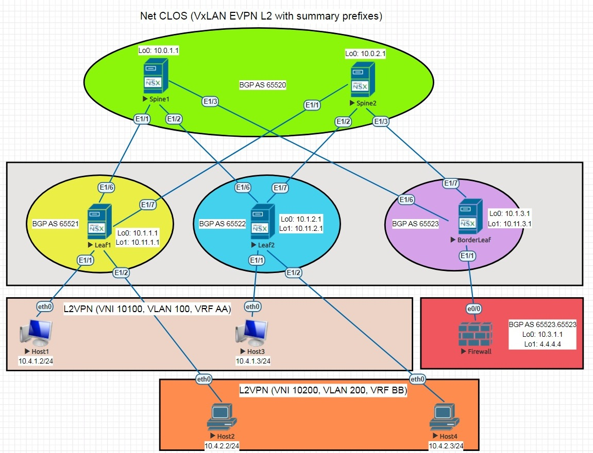

# lab8. VxLAN 4.
### Цель: 
Реализовать передачу суммарных префиксов через EVPN route-type 5
- Анонсируете суммарные префиксы клиентов в Overlay сеть.
- Настроите маршрутизацию между клиентами через суммарный префикс.
### Порядок работы:
- За основу взята схема из ДЗ VXLAN1. Клиенты 1-4 подключены к Leaf1 и Leaf2. Клиенты 1 и 3 - vlan 100, vrf AA. Клиенты 2 и 4 - vlan 200, vrf BB.
- Leaf3 получил роль BorderLeaf без подключенных клиентов.
- К BorderLeaf подключен FireWall, обеспечивает доступность между клиентами в vrf AA и vrf BB.
### Результат:
- Схема сети.

- Распределение адресного пространства.

- Файлы с конфигурациями Nexus9K и клиентами:
- Конфигурация

- Конфигурация

- Конфигурация

- Конфигурация

- Конфигурация

- Конфигурация

- Конфигурации клиентов

- Результаты диагностики BGP neighbors

- Результаты диагностики BGP Route 

- Результаты диагностики BorderLeaf

- Результаты диагностики c клиентов Host1 и 2

- Результаты диагностики c клиентов Host3 и 4

